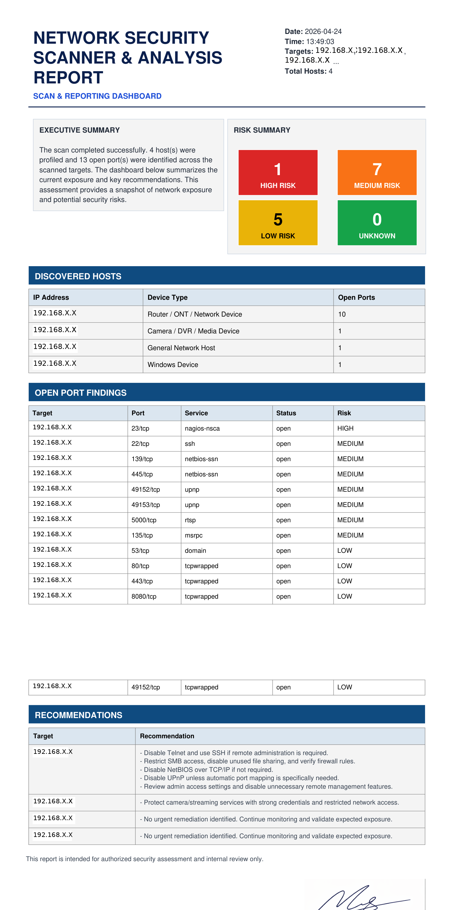

# 🛡️ Network Security Scanner & Reporting Tool

A Python-based automated network security scanning and reporting tool designed for defensive cybersecurity analysis.

---

## 📌 Overview

The **Network Security Scanner & Reporting Tool** is a lightweight yet powerful cybersecurity solution that automates network discovery, port scanning, risk classification, and professional report generation.

It helps security analysts quickly assess network exposure and identify potential vulnerabilities.

---

## 🚀 Features

* 🔍 Automated network discovery
* 🌐 Multi-target scanning
* 🔓 Open ports and service detection using Nmap
* ⚠️ Risk classification (High / Medium / Low / Unknown)
* 📊 Professional dashboard-style PDF reports
* 📁 Multiple output formats (TXT, JSON, PDF)
* 🧠 Structured analysis and recommendations

---

## 🛠️ Technologies Used

* Python
* Nmap
* ReportLab
* JSON

## 📸 Sample Report Preview

Below is a simple sample report generated by the scanner.  
It demonstrates the basic output and reporting format.



---

## 📂 Project Structure

```
network_security_scanner/
│
├── core/            # Scanning and analysis logic
├── reports/         # Report generation (PDF, TXT)
├── utils/           # Utilities (network, logging, discovery)
├── outputs/         # Generated reports (ignored in Git)
├── assets/          # Images and branding
├── main.py          # Entry point
├── config.py        # Configuration
├── requirements.txt
└── README.md
```

---

## ⚙️ Installation

```bash
git clone https://github.com/MoAdel111/network-security-scanner.git
cd network-security-scanner
pip install -r requirements.txt
```

---

## ⚡ Quick Start

```bash
py main.py
```

---

## 📊 Sample Output

The tool generates:

* ✔ Detailed TXT reports
* ✔ Structured JSON reports
* ✔ Professional PDF dashboards

---

## ⚠️ Disclaimer

This tool is intended for **educational and authorized security testing purposes only**.
Do not scan networks without proper permission.

---

## 👨‍💻 Author

Mohamed Elsayed
Cybersecurity Analyst | Security+ Certified
